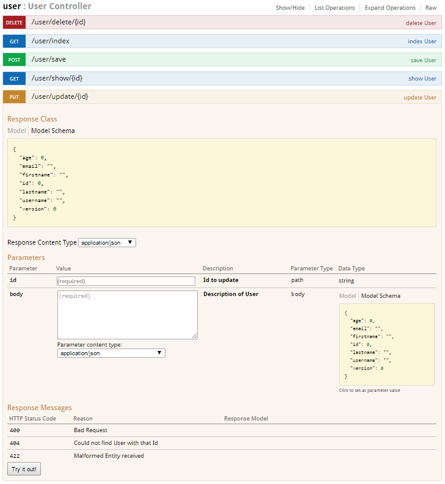

swaggydoc
---------
API docs for Grails 3.1.x Restful API

Challenge with REST API documentation is, it quickly get out of sync with current implementation as developers implement new futures.

This project demonstrate how developers can generate API docs and keep in sync with code changes. 



### Setup

1. Create a project
```bash
# create a new API project
grails create-app rest-api-docs  
# grails create-app rest-api-docs --profile rest-api
# create a domain and a controller
cd swaggydoc
grails create-domain-class User
grails create-restful-controller User
# add URL mapping for this API in UrlMappings.groovy
"/users"(resources: 'user')
```

2. Add swaggydoc dependency after `profile` dependency

    `compile "org.grails.plugins:swaggydoc-grails3:0.26.0"`

3. Optionally annotate your REST controllers

    1. Simple 
    ```groovy
    @Api(value = 'user', description = 'User Management  API')
    class UserController extends RestfulController {
        static responseFormats = ['json', 'xml']
        UserController() {
            super(User)
        }
    }
    ```
    2. Custom
    ```groovy
    @Api(value = 'user', description = 'User Management  API')
    class UserController extends RestfulController {
        static responseFormats = ['json', 'xml']
        UserController() {
            super(User)
        }
        @SwaggyList
        def index(Integer max) {
            super.index(max)
        }
        @SwaggyShow
        def show() {
            super.show()
        }
        @Transactional
        @SwaggySave
        def save() {
            super.save()
        }
        @Transactional
        @SwaggyUpdate
        def update() {
            super.update()
        }
        @Transactional
        @SwaggyDelete
        def delete() {
            super.delete()
        }   
    }
    ``` 

4. Run app

```bash
gradle bootRun
```